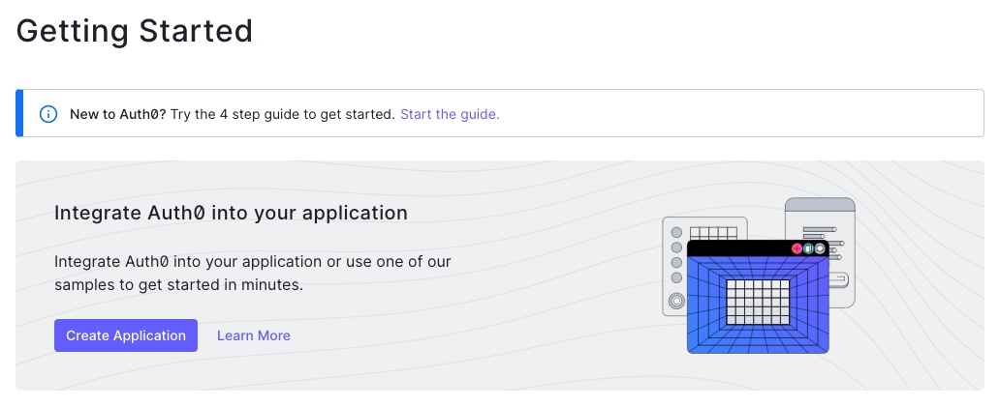
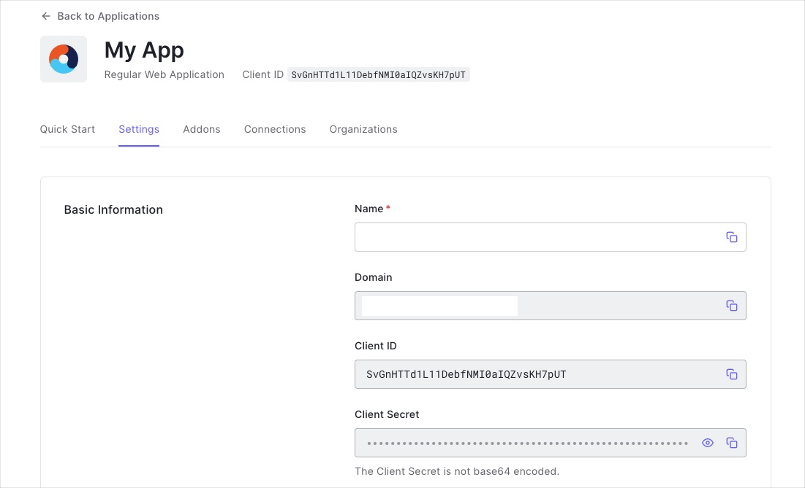
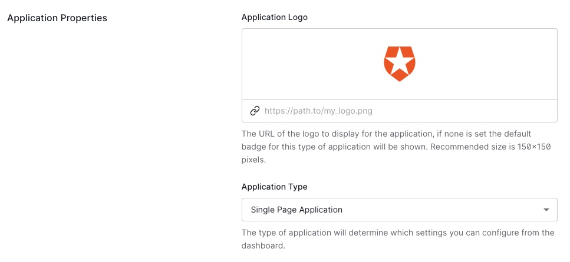
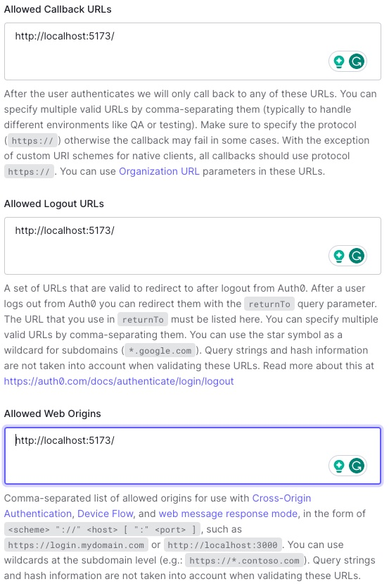

# Techtonica Final Project Template

For anyone struggling to integrate Auth0 and  react-router, here's a template you can use to get started. I'll try to write this README as a step-by-step guide with the assumption you know very little about Auth0 and react-router.

## Install Dependencies

The dependencies that this template uses that are not automatically configured by Vite are the following:

```bash
npm i @auth0/auth0-react react-router-dom react-bootstrap bootstrap
```

## React Router Setup

What the heck is "React Router?" Let's get started with the concept of routing and what it enables us to do in our React app. On any given website you visit, you have different pages and each page has their own URL. Traditionally, React websites are "single page applications," so how do you get multiple pages out of React? Enter, React Router.

### Defining Routes

Following this template/pattern, all of your routes are defined in a single place. In this template, that place is **[src/App.jsx](src/App.jsx#L9-28)**. Let's take a look at the code:

```jsx
const router = createBrowserRouter([
    {
        path: "/",
        element: <Root />,
        children: [
            {
                index: true,
                element: <Home />,
            },
            {
                path: 'about',
                element: <About />,
            },
            {
                path: 'profile',
                element: <Profile />,
            }
        ],
    },
]);
```

What does any of this mean? Let's break it down.

### The Root Layout

The "root" layout is a special component that makes use of the `<Outlet />` component and is the base of every page across the entire website. Want to share your navigation bar across all pages? Put it in the root layout. Want to share a footer across all pages? Put it in the root layout. Want to share a sidebar across all pages? Put it in the root layout. You get the idea.

Let's take a look at the root layout component, **[src/pages/Root.jsx](src/pages/Root.jsx)**:

```jsx
<div>
    <NavBar />

    <div className="container">
        <Outlet />
    </div>
</div>
```

When we visit the `/about` page, the `<Outlet />` component will get "replaced" by whatever respective component you specified in the route definition; i.e. `<About />`.

The `path` key defines the URL pattern where this root layout is used. Since the path is simply `/`, then that means any URL for your website that starts with `/` will be affected by this; in other words, all of them. 

```jsx
{
    path: "/",
    element: <Root />,
    children: [...],
}
```

### "Children" Pages

This is a weird naming convention since they're not technically "children pages" but they are children to the root layout. 

#### The Home Page

The `index` key is a special key that tells React Router that this page is the "index" page for the root layout. In other words, this is the page that will be shown when the URL matches the root layout's path. In this case, the root layout's path is `/`, so the index page will be shown when the URL is `/`. 

```jsx
{
    index: true,
    element: <Home />,
}
```

#### Other Pages

Now that we've gotten the homepage down and working, let's define the other pages. The `path` key defines the URL pattern where this page is used. Since the path is simply `about`, then that means the URL for this page will be `/about`.

```jsx
{
    path: 'about',
    element: <About />,
}
```

### Using the Routes

Last step is to make use of the routes by calling the `<RouterProvider />` component. This component is the brains of knowing what to render depending on the URL. Since `<App />` is our actual React application, we have it call the Router Provider, and we're done with that!

```jsx
const App = () => (
    <RouterProvider router={router}/>
);
```

## Configuring Auth0

Alright, this is a two part debacle. First, we need to configure Auth0 in the Auth0 dashboard. Second, we need to configure Auth0 in our app.

### Configuring Auth0 in the Dashboard

1. Create an account on [Auth0](https://auth0.com/).
2. Create a new application.
   
3. Go to the "Settings" tab
   1. Make a copy of `.env.example` and rename it to `.env`
   2. Copy the "Domain" and "Client ID" values and paste them into the respective environment variables in `.env`
      
   3. Make sure the "Application Type" is set to "Single Page Web Applications."
      
   4. Add `http://localhost:5173/` to the "Allowed Callback URLs", "Allowed Logout URLs", and "Allowed Web Origins" fields.
      

### Configuring Auth0 in the App

All the Auth0 configuration will happen in our [`src/main.jsx`](./src/main.jsx). Let's take a look at the relevant code:

```jsx
<Auth0Provider
   domain={import.meta.env.VITE_AUTH0_DOMAIN}
   clientId={import.meta.env.VITE_AUTH0_CLIENT_ID}
   authorizationParams={{
     redirect_uri: window.location.origin
   }}
>
   <App />
</Auth0Provider>
```

We need to make sure the entire React application has Auth0 configuration and functionality available to it, so we wrap the `<App />` usage with it. Since `<Auth0Provider />` is the parent of `<App />`, that means `<App />` and all of its children will have access to Auth0.

## Using Auth0 in Your Site

Now that we have Auth0 configured, let's use it! Let's take a look at how to use it in [`src/components/NavBar.jsx`](./src/components/NavBar.jsx):

If your component needs to have any information about the user, you can use the `useAuth0()` hook to get access to the user's information.

```jsx
const NavBar = () => {
   const { isAuthenticated, loginWithRedirect, logout, user } = useAuth0();

   // ...
};
```

In this case, we're using the `isAuthenticated` property to determine if the user is logged in or not. If they are, we show a "Log Out" button. If they're not, we show a "Log In" button. Additionally, if `isAuthenticated` is true, then the `user` object will be a non-null value containing all the user's information such as email address, name, etc.

```jsx
{isAuthenticated ? (
    <>
        <Link className="nav-link fst-italic" to="/profile">
            {user.email}
        </Link>
        <button
            className="btn btn-primary"
            onClick={() => logout()}
        >
            Log Out
        </button>
    </>
) : (
    <button
       className="btn btn-primary"
       onClick={() => loginWithRedirect()}
    >
        Log In
    </button>
)}
```

For another example using the `isAuthenticated` variable is the [`src/pages/Profile.jsx`](src/pages/Profile.jsx) page. In this case, we're using it to determine if we should show the user's profile or not. If the user is not logged in, we show them an error message.

## Making `fetch` requests to the backend

When you're making `fetch` requests to the backend, ensure that you check `isAuthenticated` to be true and in the data that is being sent to the backend includes either `user.email` or `user.sub`. The `user.sub` is a unique identifier that Auth0 provides for each user. This is the preferred method of identifying a user since email addresses can change.

// There is more for me to write here but I'm getting tired tonight. I'll come back to it later.
